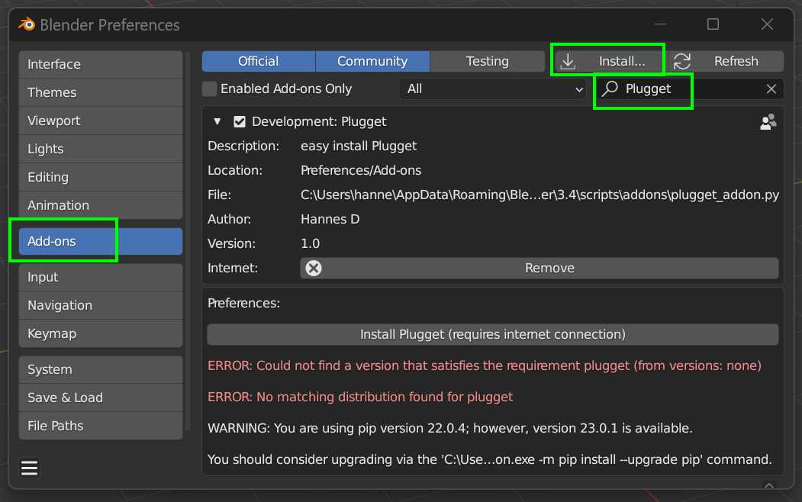

# Plugget installer add-on
A blender add-on to install [plugget](https://github.com/hannesdelbeke/plugget)

## Installation
1. download this repo as a zip and extract the zip. ensure you have the file `plugget_addon.py`
2. Go to `Edit/Preferences... (menu) -> add-ons (tab)` and click `Install` button
3. Browse to the `plugget_addon.py`
4. In the search bar, type `plugget` and enable the add-on
5. On enable, the plugget-installer add-on will automatically install plugget. And show any errors below the install button.
You should now see a message saying `plugget installed successfully`.
If something failed you can always try again by clicking the install button, or disable and re-enable the add-on

